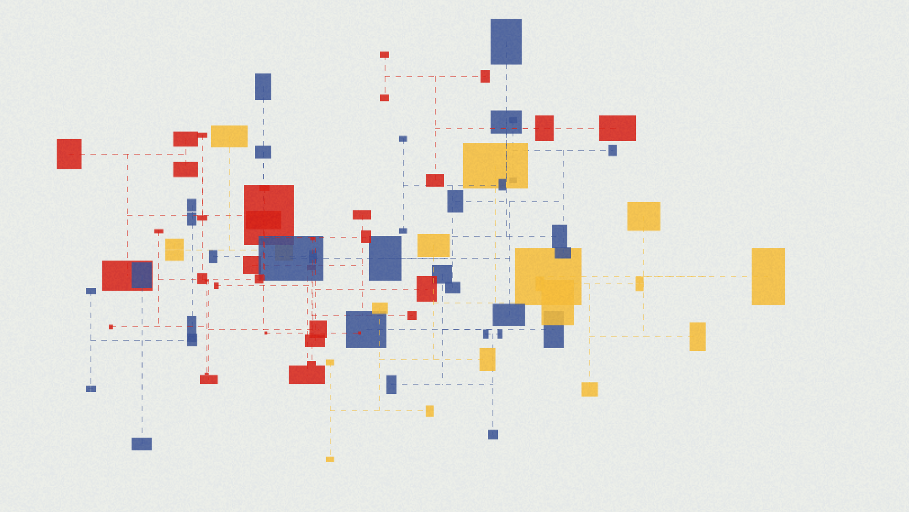

# VTBB &middot; [](http://makeapullrequest.com)

> :art: :microphone: An interative toy, an audio visual work. It's Written in Processing for visual, pure data for sound.

[demo](https://vimeo.com/184943616)


## 0. Table of Contents  
- [Download](#1-download)
- [Dependencies](#2-dependencies)
- [Run](#3-run)

## 1. Download

First, clone the project. Or you can just download as .zip.
```
git clone https://github.com/vibertthio/VTBB.git VTBB
cd VTBB/vtbb
```

## 2. Dependencies
You need to download several dependencies in Processing IDE.
If you have on idea how to download Processing libraries, you can follow the [instruction](https://github.com/processing/processing/wiki/How-to-Install-a-Contributed-Library) in Processing's wiki page.

- [oscP5](http://www.sojamo.de/libraries/oscP5/)
- [controlP5](https://github.com/sojamo/controlp5)


## 3. Run

Second, open the files with Processing IDE and run!
